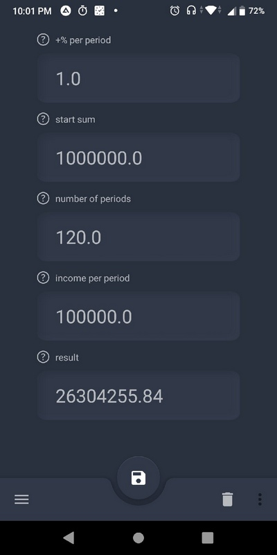

# KotlinCalculator

Here you can see my calculator for calculatoin dificult percent.
Also you can save and restore your input data in Room database.
The history is shown by Recycle view.
The desing was implemented via Flatter and was made according to Matreail Design rules.

Used technologies: Kotlin, Room, RecyleView, BottomNavigationView.

